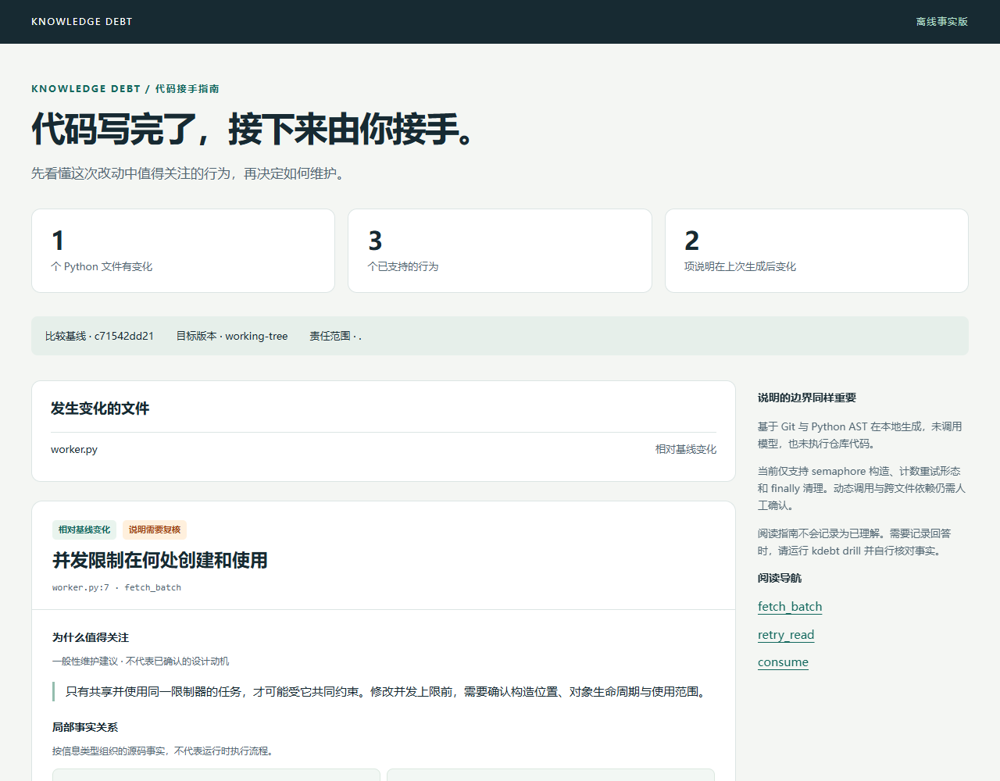

# Knowledge Debt

**AI 写完代码后，生成一份你能核对的接手指南。**

Knowledge Debt 是一个本地 Python CLI：把一次代码改动整理成可阅读的 HTML / Markdown 接手指南，
展示值得关注的行为、源码依据、维护注意事项和待确认问题，并在后续生成时提示哪些说明需要复核。

## v0.2 新入口：代码接手指南

```bash
kdebt brief --base HEAD --lang zh
kdebt brief src/cache --base HEAD --lang zh
kdebt brief --base HEAD~2 --head HEAD --lang zh
```

打开命令输出的 HTML 路径即可阅读，不需要启动服务器。默认比较当前工作区与 HEAD，
显式指定 `--head` 则比较两个提交，不受工作区未提交修改影响。



[示例 HTML](docs/demo/index.html) · [示例 Markdown](docs/demo/guide.md) · [使用与边界](docs/brief.md)

示例来自合成代码，HTML 需要下载后用浏览器打开；GitHub 文件页只显示源码。
指南包含行为卡片、可展开的源码、前后事实对照、一般维护建议和未知事项。

每次生成会在 `.kdebt/briefs/` 保存独立快照。再次运行时，对说明标记未变化、新增、需要复核、
已移除或无法验证。代码变化后需要重新运行命令，当前没有自动监视器。

这是**离线事实版**：没有调用 LLM，事实保留分析器的英文原文；中文页面提供中文标题和维护说明。
不会猜测完整调用链或业务目的。阅读不计为已理解；模型解释扩展尚未实现。

[English](README.md) · [设计](docs/design.md) · [Agent 接入](docs/agent-integration.md) · [路线图](docs/roadmap.md)

> Knowledge Debt = 代码已经进入你的责任范围，但理解可能尚未同步。
>
> 没有理解证据，不等于不理解；Git 作者身份，也不等于理解。

## 先体验一次

需要 Python 3.10+ 和 Git。当前从源码安装，不依赖已经存在的 PyPI 发布。

```bash
git clone https://github.com/LaJarjan/Knowledge-Debt.git
cd Knowledge-Debt
python -m pip install .
kdebt scan examples
kdebt drill examples/worker.py
```

程序会问：在 `fetch_batch` 中，semaphore 在哪里构造、初始值是什么？
当前函数体能识别到哪些对应的使用语法？嵌套闭包或其他方法中的使用情况还有哪些未知？

先回答，再看源码事实清单，自己勾选原回答覆盖了哪些事实。结果是“本次自查覆盖 2/4 个事实”，
不会显示“你的理解程度从 31% 提升到 57%”。当前命令行问题为英文，Agent 可以翻译。

## 在自己的仓库使用

```bash
kdebt init --scope src          # 可选；不配置则假设负责整个仓库
kdebt scan                     # 最多显示 5 个候选
kdebt scan --since HEAD         # 暂存、未暂存和未跟踪的新代码
kdebt scan --since HEAD~3       # 从一个历史提交比较到当前工作区
kdebt explain src/worker.py     # 查看原因、源码事实和推断边界
kdebt drill src/worker.py       # 一次只问一个问题
kdebt drill src/worker.py --show-facts  # 直接看事实，不记为理解证据
```

直接运行 `kdebt` 等同 `kdebt scan`。多个责任目录重复传 `--scope`。
路径都相对于 Git 仓库根目录；在外部使用 `kdebt --repo 仓库路径 scan`。

## 第一版的取舍

**已经实现：**

- Git 工作区读取、指定版本比较、责任范围过滤。
- Python AST 提取三类候选：已解析导入的 semaphore 构造、有成功退出和异常延迟的计数重试形态、finally 中的清理调用。
- 支持常见导入别名；跳过自定义同名调用、名字遮蔽和常见普通批处理循环。
- 每个事实带行号和源码表达式。
- 单题交接、自查清单、SQLite 本地回答记录。
- 函数、同文件依赖、类继承或装饰器变化后提醒重新检查，注释和格式化不使记录失效。
- HTML / Markdown 接手指南、历史快照、JSON 输出和仓库内 Agent Skill。

**暂未实现：**

- AI 生成比例检测、自动理解评分、自然语言语义匹配。
- 全量工程概念识别、跨文件调用图、完整语义等价分析。
- 自动定时提醒、IDE 插件、MCP 服务、云端账户和团队评分。

当前版本是可运行的 alpha。AST 只能提供有限的结构事实：看到 `close()` 不意味着一定完成清理；
看到 `Semaphore(32)` 不意味着已经证明并发请求被限制。每类题都会标明边界。

## 指标不装懂

| 状态 | 含义 |
| --- | --- |
| unrecorded | 未记录回答，理解状态未知 |
| answer_recorded | 有回答，未自查事实 |
| partial | 当前只自查了部分事实 |
| self_checked | 当前清单的所有事实均自查，仍不代表完全理解 |
| stale | 最新回答对应的代码指纹已变化 |

HIGH 表示记录过期，或与指定基线相比变化且没有完整事实自查；MEDIUM 表示仍有事实待检查；
LOW 只用于全部列出事实已自查。同优先级优先未答或较早回答的条目，避免反复问同一题。
以最新回答为准，不自动把多次零散自查拼成完整理解。

`--since` 的统计分母只包含筛选出的变化概念。工具未支持的代码不会计为“已理解”。
文件或函数改名会创建新实例；模块声明变化可能保守地使多个记录过期，跨文件依赖变化暂未追踪。

v0.1.1 的 JSON 升级为 `schema_version: 2`，增加 `partial` 状态。旧数据库和回答保留，
新分析器会使仍能识别的旧概念记录变为待复核，避免用旧事实编号错误覆盖新清单。

## 隐私与接入

CLI 零第三方运行时依赖，无 API Key、网络请求和遥测，也不会执行被分析的代码。
扫描不创建状态，初始化或回答后将记录存入 `.kdebt/`，目录自带 Git 忽略规则。
记录没有加密，不要强制加入 Git 或放入公开压缩包。
生成指南也会写入该目录，但不写入理解证据。指南含源码片段，分享前请自行检查；仓库公开的仅为合成示例。

随仓库提供的 [Skill](skills/knowledge-debt/SKILL.md) 负责对话，CLI 负责分析和存储。
它尚未自动安装。Agent 读取 JSON 后的数据处理遵循其自身规则，JSON 会包含源码表达式。
Agent 不能替用户答题并将自己的解释记成用户理解证据。

## 开发

```bash
python -m pip install -e .
python -m unittest discover -s tests -v
```

最欢迎的反馈：一个真实代码片段，以及“这道题哪里问得好／哪里不准确”。
先让维护者觉得问题值得回答，再扩大概念覆盖范围。

新增 24 个合成识别样例、交互回归及性能基准脚本。详见[验证说明](docs/validation.md)。
真实维护者是否觉得题目有用，仍需用户试用验证。
