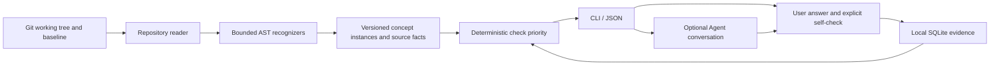

# Product and technical design

## Product decision

Build a two-minute code handoff for individual Python maintainers, especially
people accepting coding-agent changes. The first interaction is a useful question
about a current diff, not a dashboard of assumed ignorance.

The reusable product is **change → concept instance → question → evidence →
revalidation**. The current distribution is a CLI plus a thin Agent Skill. An IDE
entry point is contingent on repeat use; an independent desktop app is not planned.

## Architecture

No imports of target repository modules; no subprocess execution except read-only
Git commands. No model provider is required. Runtime dependencies are standard
library modules; setuptools is only a packaging/build dependency.

## Contracts

A concept instance has a stable ID derived from path, qualified symbol, kind and
ordinal, a function/context fingerprint, a question, a caveat, and source facts.
Every fact contains an ID, text, line and expression. IDs are stable across pure
line shifts; they are not a cross-rename identity system.

Fingerprints use location-free AST dumps plus module and enclosing context. They
are conservatively syntactic: a harmless semantic rewrite may invalidate evidence.
Global declarations are included to avoid preserving evidence after a local
configuration constant changes. Changes in imported files are not yet followed.

v0.1.1 also follows transitively referenced same-file definitions, including
same-class helpers, and includes class bases, keywords and decorators. This is
conservative name-based dependency tracking, not a complete Python call graph.
Local shadows may cause extra invalidation. A version salt invalidates surviving
v0.1.0 evidence because the fact checklist and recognition rules changed.

`evidence` is append-only and stores concept ID, fingerprint, literal answer,
self-checked fact IDs, UTC timestamp, optional HEAD and `user_self_report`
provenance. The latest record determines the display state. Past answers do not
automatically reappear as fresh mastery when a branch happens to return to old code.

Recording through JSON requires the displayed ID and fingerprint. Interactive
drills re-read the concept after the user answers. This prevents most accidental
attribution to a different code version; the source tree is not locked, so there is
no transactional guarantee against an edit racing the final write.

## Recognizers and epistemic boundaries

| Candidate | Trigger | Facts | Not established |
| --- | --- | --- | --- |
| Concurrency | Function-local call resolving lexically to asyncio/threading Semaphore or BoundedSemaphore | Callable spelling, initial argument, construction scope, matching direct-body uses | Runtime object identity, shared lifetime, downstream capacity |
| Retry | range loop with a direct try, try-body exit, and known delay in a handler; rejects obvious per-index batch calls | Iterator, delayed exception types, delay expression, exit | Actual number of attempts, idempotency, complete control flow |
| Cleanup | try/finally containing close, aclose or release | Finally suite and contained cleanup call | Guaranteed completion, cancellation safety, ownership |

These are intentionally syntax candidates. Common import aliases are resolved;
custom/unknown semaphore callables and shadowed bindings are skipped. While-loop
retries, context-manager cleanup and more complex patterns may be missed. Nested
function bodies are not attributed to enclosing cleanup suites. No classifier
probability is exposed.

## Metrics

- **Debt:** prioritized checks within explicit responsibility scope.
- **Coverage:** complete current fact self-check count / supported instances in the selected
  analysis scope. Never call this total knowledge coverage.
- **Drift:** current instances whose latest answer fingerprint is stale. v0.1
  exposes a count, not a time-series rate or a monthly percentage.

The UI uses plain counts and states. Do not manufacture a percentage when the
denominator is zero, extrapolate from supported code to all code, or equate absent
telemetry with absent debugging.

Partial checklists remain pending. The latest answer alone determines coverage;
multiple incomplete answers are not unioned into mastery. Tied priorities prefer
never-recorded instances, then the oldest latest record, enabling drill rotation.
All latest evidence is loaded with one read-only database query per scan. Baseline
scans ask Git for changed paths before reading source blobs.

## Deliberate exclusions

No Git author heuristics, AI-authorship classifier, weighted complexity formula,
vector store, generic knowledge graph platform, automatic LLM grading, employee
leaderboard, or mandatory commit gate. The biggest unknown is whether the question
is useful, not whether the project can collect more metrics.
